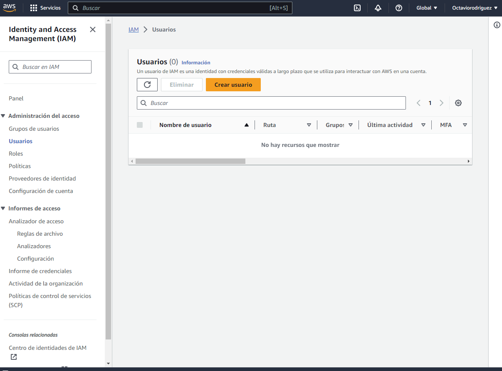
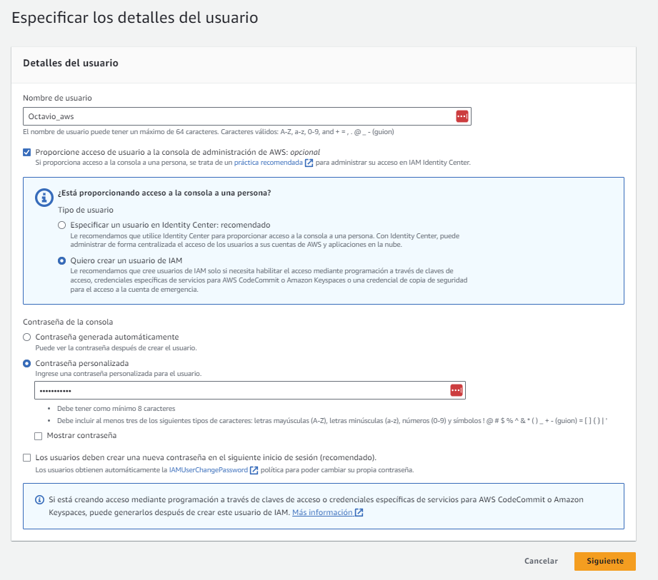

Proyecto de AWS y Pyspark
=========================
## Descripción
Vamos a crear un proyecto end to end de un sistema de videos de youtube, desde la extracción de datos hasta la visualización de los mismos.

utilizaremos el dataset de [Kaggle](https://www.kaggle.com/datasnaek/youtube-new) que contiene los datos de los videos de youtube de varios paises.

## Estructura del proyecto
El proyecto se divide en 3 partes:

1. Preparación del entorno
2. Extracción de datos
3. Procesamiento de datos
4. Visualización de datos
5. Despliegue en AWS
6. Automatización


## Preparación del entorno
Antes de empezar el proyecto vamos a dar de alta la cuenta de AWS y crear un usuario con permisos de administrador.

1. Creamos la cuenta siguiendo los pasos de este link de amazon  https://repost.aws/es/knowledge-center/create-and-activate-aws-account
2. Creamos un usuario con permisos de administrador siguiendo los pasos de este link de amazon https://docs.aws.amazon.com/es_es/IAM/latest/UserGuide/getting-started_create-admin-group.html
   
    - Entramos a (IAM)
    
    - Creamos un usuario, usando estos parámetros:
    
    - Descargamos el archivo .csv que contiene las credenciales del usuario

            
# Comando para copiar en el bucket la carpeta con los datos

```bash
aws s3 cp . s3://de-holyproject-raw-useast1-dev/raw_statistics_reference_data/ --recursive --exclude "*" --include "*.json"
```

```bash
# To copy all data files to its own location, following Hive-style patterns:
aws s3 cp CAvideos.csv s3://de-holyproject-raw-useast1-dev/raw_statistics/region=ca/
aws s3 cp DEvideos.csv s3://de-holyproject-raw-useast1-dev/raw_statistics/region=de/
aws s3 cp FRvideos.csv s3://de-holyproject-raw-useast1-dev/raw_statistics/region=fr/
aws s3 cp GBvideos.csv s3://de-holyproject-raw-useast1-dev/raw_statistics/region=gb/
aws s3 cp INvideos.csv s3://de-holyproject-raw-useast1-dev/raw_statistics/region=in/
aws s3 cp JPvideos.csv s3://de-holyproject-raw-useast1-dev/raw_statistics/region=jp/
aws s3 cp KRvideos.csv s3://de-holyproject-raw-useast1-dev/raw_statistics/region=kr/
aws s3 cp MXvideos.csv s3://de-holyproject-raw-useast1-dev/raw_statistics/region=mx/
aws s3 cp RUvideos.csv s3://de-holyproject-raw-useast1-dev/raw_statistics/region=ru/
aws s3 cp USvideos.csv s3://de-holyproject-raw-useast1-dev/raw_statistics/region=us/

```

